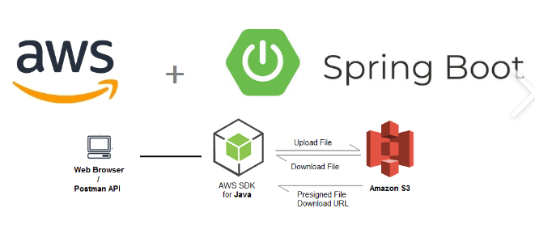
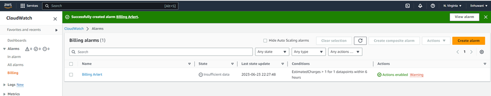
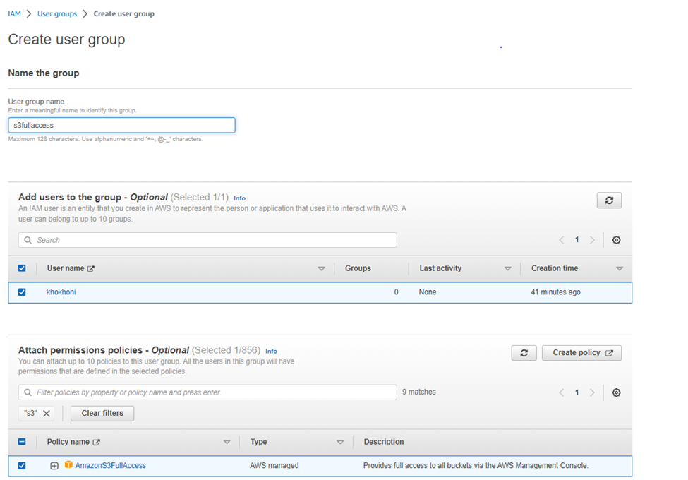
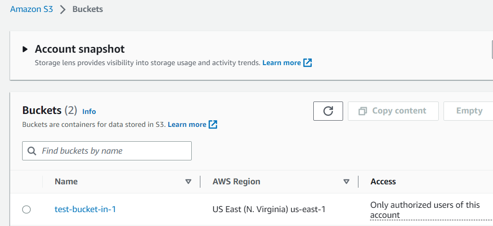
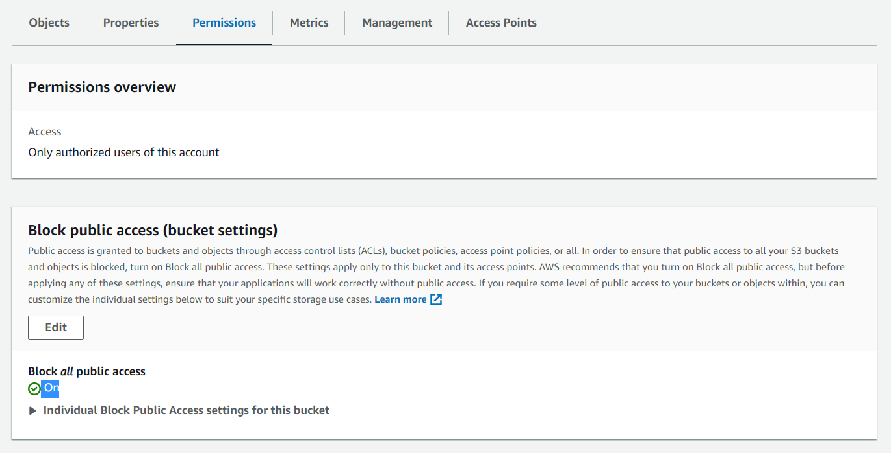
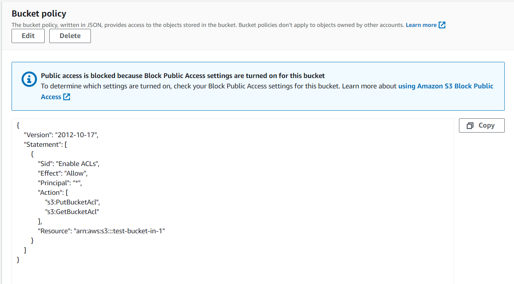
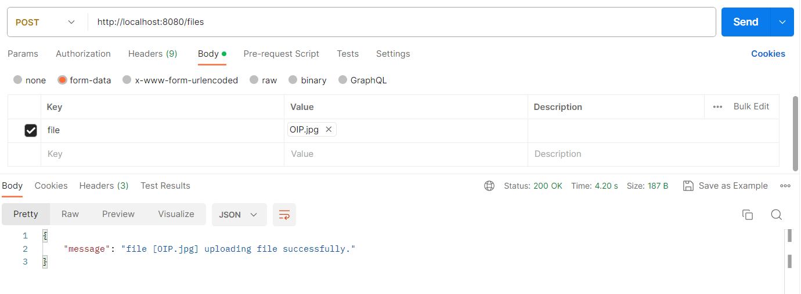
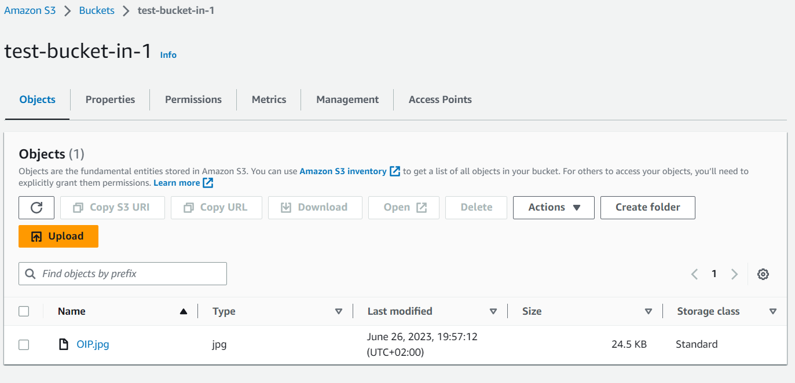

##Spring Boot Amazon S3 Bucket API

### 1. Introduction
Amazon S3 is one of the services from [Amazon Web Services](https://aws.amazon.com/), which provides object storage service that stores data as objects in buckets. In this project we will upload files to the S3 bucket using an API.

### 2. Architecture

### 3. SETUP

####3.1 AWS SETUP

- Setup the billing alert to warn you when you exceed your budget.Please note that this is setup is OPTIONAL,

- Create an IAM user. The credentials for this user will be used  to access the S3 bucket 

  
- Create the S3 bucket 

-Setup the S3 bucket permission

####3.2 API SETUP

####Prerequisites
   - Java 8+
   - Maven 3+
   - AWS Free Account
   - Root and I am AWS Credentials and Region 
   - S3 Bucket
   - IDE 
####Dependencies
   - Spring Web
   - Spring Dev Tools
   - AWS Java SDK
   - Lombok

###How to run the API locally

Run the command below in the terminal
- mvn clean install
- java -jar -Dspring.profiles.active=local target/<jarFileName>.jar

###Upload the file using Postman

###Check the file in AWS

### 4.  Reference
https://momentummetropolitan.udemy.com/course/introduction-to-cloud-computing-on-amazon-aws-for-beginners/learn/lecture/34499922#overview

Thank you